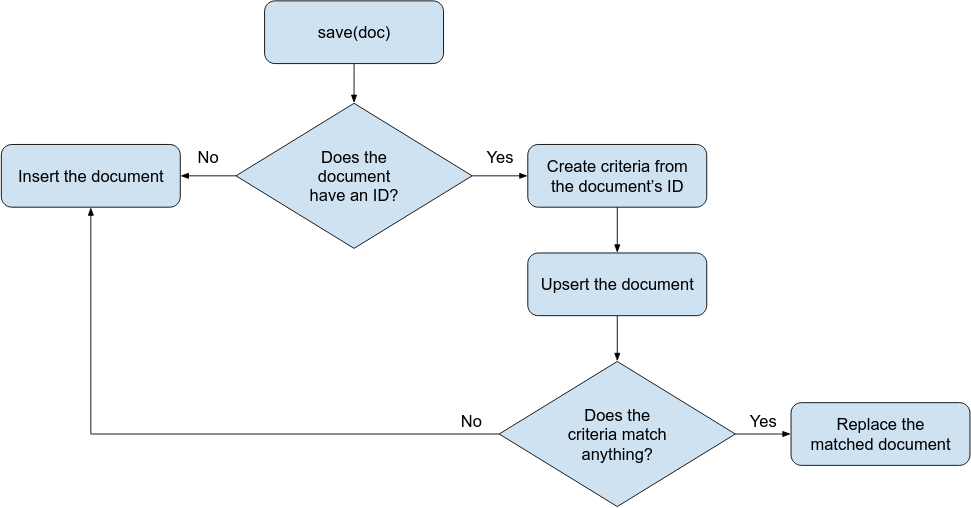

# Upgrade Guide

The MongoDB PHP Library and underlying [mongodb extension][ext-mongodb] have
notable API differences from the legacy [mongo extension][ext-mongo]. This page
will attempt to summarize those differences for the benefit of those upgrading 
from the legacy driver.

Additionally, a community-developed [mongo-php-adapter][adapter] library exists,
which implements the [mongo extension][ext-mongo] API using this library and the
new driver. While this adapter library is not officially supported by MongoDB,
it does bear mentioning.

[ext-mongo]: http://php.net/mongo
[ext-mongodb]: http://php.net/mongodb
[adapter]: https://github.com/alcaeus/mongo-php-adapter

## Collection API

This library's [MongoDB\Collection][collection] class implements MongoDB's
cross-driver [CRUD][crud-spec] and [Index Management][index-spec]
specifications. Although some method names have changed in accordance with the
new specifications, the new class provides the same functionality as the legacy
driver's [MongoCollection][mongocollection] class with some notable exceptions.

[collection]: classes/collection.md
[crud-spec]: https://github.com/mongodb/specifications/blob/master/source/crud/crud.rst
[index-spec]: https://github.com/mongodb/specifications/blob/master/source/index-management.rst
[mongocollection]: http://php.net/mongocollection

### Old and New Methods

| [MongoCollection][mongocollection] | [MongoDB\Collection][collection] |
| --- | --- |
| [aggregate()](http://php.net/manual/en/mongocollection.aggregate.php) | [aggregate()](classes/collection.md#aggregate) |
| [aggregateCursor()](http://php.net/manual/en/mongocollection.aggregatecursor.php) | [aggregate()](classes/collection.md#aggregate) |
| [batchInsert()](http://php.net/manual/en/mongocollection.batchinsert.php) | [insertMany()](classes/collection.md#insertmany) |
| [count()](http://php.net/manual/en/mongocollection.count.php) | [count()](classes/collection.md#count) |
| [createDBRef()](http://php.net/manual/en/mongocollection.createdbref.php) | Not yet implemented ([PHPLIB-24][jira-dbref]) |
| [createIndex()](http://php.net/manual/en/mongocollection.createindex.php) | [createIndex()](classes/collection.md#createindex) |
| [deleteIndex()](http://php.net/manual/en/mongocollection.deleteindex.php) | [dropIndex()](classes/collection.md#dropindex) |
| [deleteIndexes()](http://php.net/manual/en/mongocollection.deleteindexes.php) | [dropIndexes()](classes/collection.md#dropindexes) |
| [drop()](http://php.net/manual/en/mongocollection.drop.php) | [drop()](classes/collection.md#drop) |
| [distinct()](http://php.net/manual/en/mongocollection.distinct.php) | [distinct()](classes/collection.md#distinct) |
| [ensureIndex()](http://php.net/manual/en/mongocollection.ensureindex.php) | [createIndex()](classes/collection.md#createindex) |
| [find()](http://php.net/manual/en/mongocollection.find.php) | [find()](classes/collection.md#find) |
| [findAndModify()](http://php.net/manual/en/mongocollection.findandmodify.php) | [findOneAndDelete()](classes/collection.md#findoneanddelete), [findOneAndReplace()](classes/collection.md#findoneandreplace), and [findOneAndUpdate()](classes/collection.md#findoneandupdate) |
| [findOne()](http://php.net/manual/en/mongocollection.findone.php) | [findOne()](classes/collection.md#findone) |
| [getDBRef()](http://php.net/manual/en/mongocollection.getdbref.php) | Not yet implemented ([PHPLIB-24][jira-dbref]) |
| [getIndexInfo()](http://php.net/manual/en/mongocollection.getindexinfo.php) | [listIndexes()](classes/collection.md#listindexes) |
| [getName()](http://php.net/manual/en/mongocollection.getname.php) | [getCollectionName()](classes/collection.md#getcollectionname) |
| [getReadPreference()](http://php.net/manual/en/mongocollection.getreadpreference.php) | Not implemented |
| [getSlaveOkay()](http://php.net/manual/en/mongocollection.getslaveokay.php) | Not implemented |
| [getWriteConcern()](http://php.net/manual/en/mongocollection.getwriteconcern.php) | Not implemented |
| [group()](http://php.net/manual/en/mongocollection.group.php) | Not yet implemented ([PHPLIB-177][jira-group]). Use [Database::command()](classes/database.md#command) for now. |
| [insert()](http://php.net/manual/en/mongocollection.insert.php) | [insertOne()](classes/collection.md#insertone) |
| [parallelCollectionScan()](http://php.net/manual/en/mongocollection.parallelcollectionscan.php) | Not implemented |
| [remove()](http://php.net/manual/en/mongocollection.remove.php) | [deleteMany()](classes/collection.md#deleteMany) and [deleteOne()](classes/collection.md#deleteone) |
| [save()](http://php.net/manual/en/mongocollection.save.php) | [insertOne()](classes/collection.md#insertone) or [replaceOne()](classes/collection.md#replaceone) with "upsert" option |
| [setReadPreference()](http://php.net/manual/en/mongocollection.setreadpreference.php) | Not implemented. Use [withOptions()](classes/collection.md#withoptions). |
| [setSlaveOkay()](http://php.net/manual/en/mongocollection.getslaveokay.php) | Not implemented |
| [setWriteConcern()](http://php.net/manual/en/mongocollection.setwriteconcern.php) | Not implemented. Use [withOptions()](classes/collection.md#withoptions). |
| [update()](http://php.net/manual/en/mongocollection.update.php) | [replaceOne()](classes/collection.md#replaceone), [updateMany()](classes/collection.md#updatemany), and [updateOne()](classes/collection.md#updateone) |
| [validate()](http://php.net/manual/en/mongocollection.validate.php) | Not implemented |

[jira-group]: https://jira.mongodb.org/browse/PHPLIB-177
[jira-dbref]: https://jira.mongodb.org/browse/PHPLIB-24

A guiding principle in designing the new APIs was that explicit method names
are preferable to overloaded terms found in the old API. For instance,
[MongoCollection::save()][save] and 
[MongoCollection::findAndModify()][findandmodify] have very different modes of
operation, depending on their arguments. Methods were also split to distinguish
between [updating specific fields][update] and
[full-document replacement][replace].

[save]: http://php.net/manual/en/mongocollection.save.php
[findandmodify]: http://php.net/manual/en/mongocollection.findandmodify.php
[update]: https://docs.mongodb.org/manual/tutorial/modify-documents/#update-specific-fields-in-a-document
[replace]: https://docs.mongodb.org/manual/tutorial/modify-documents/#replace-the-document

### Group Command Helper

[MongoDB\Collection][collection] does not yet have a helper method for the
[group][group] command; however, that is planned in [PHPLIB-177][jira-group].
The following example demonstrates how to execute a group command using
[Database::command()][command]:

[command]: classes/database.md#command

```php
<?php

$database = (new MongoDB\Client)->selectDatabase('db_name');
$cursor = $database->command([
    'group' => [
        'ns' => 'collection_name',
        'key' => ['field_name' => 1],
        'initial' => ['total' => 0],
        '$reduce' => new MongoDB\BSON\Javascript('...'),
    ],
]);

$resultDocument = $cursor->toArray()[0];
```

[group]: https://docs.mongodb.org/manual/reference/command/group/

### MapReduce Command Helper

[MongoDB\Collection][collection] does not yet have a helper method for the
[mapReduce][mapReduce] command; however, that is planned in
[PHPLIB-53][jira-mapreduce]. The following example demonstrates how to execute a
mapReduce command using [Database::command()][command]:

```php
<?php

$database = (new MongoDB\Client)->selectDatabase('db_name');
$cursor = $database->command([
    'mapReduce' => 'collection_name',
    'map' => new MongoDB\BSON\Javascript('...'),
    'reduce' => new MongoDB\BSON\Javascript('...'),
    'out' => 'output_collection_name',
]);

$resultDocument = $cursor->toArray()[0];
```

[mapReduce]: https://docs.mongodb.org/manual/reference/command/mapReduce/
[jira-mapreduce]: https://jira.mongodb.org/browse/PHPLIB-53

### DBRef Helpers

[MongoDB\Collection][collection] does not yet have helper methods for working
with [DBRef][dbref] objects; however, that is planned in
[PHPLIB-24][jira-dbref].

[dbref]: https://docs.mongodb.org/manual/reference/database-references/#dbrefs

### MongoCollection::save() Removed

[MongoCollection::save()][save], which was syntactic sugar for an insert or
upsert operation, has been removed in favor of explicitly using
[insertOne()][insertone] or [replaceOne()][replaceone] (with the "upsert"
option).

[insertone]: classes/collection.md#insertone
[replaceone]: classes/collection.md#replaceone



While the [save()][save] method does have its uses for interactive environments,
such as the mongo shell, it was intentionally excluded from the
[CRUD][crud-spec] specification for language drivers. Generally, application
code should know if the document has an identifier and be able to explicitly
insert or replace the document and handle the returned InsertResult or
UpdateResult, respectively. This also helps avoid inadvertent and potentially
dangerous [full-document replacements][replace].

### Accessing IDs of Inserted Documents

In the legacy driver, [MongoCollection::insert()][insert],
[MongoCollection::batchInsert()][batchinsert], and
[MongoCollection::save()][save] (when inserting) would modify their input
argument by injecting an "_id" key containing the generated ObjectId (i.e.
[MongoId][mongoid] object). This behavior was a bit of a hack, as it did not
rely on the argument being [passed by reference][byref]; it directly modified
memory through the extension API and could not be implemented in PHP userland.
As such, it is no longer done in the new driver and library.

[insert]: http://php.net/manual/en/mongocollection.insert.php
[batchinsert]: http://php.net/manual/en/mongocollection.batchinsert.php
[mongoid]: http://php.net/manual/en/class.mongoid.php
[byref]: http://php.net/manual/en/language.references.pass.php

IDs of inserted documents (whether generated or not) may be accessed through the
result objects returned by the write methods:

 * MongoDB\InsertOneResult::getInsertedId() for [insertOne()][insertone]
 * MongoDB\InsertManyResult::getInsertedIds() for [insertMany()][insertmany]
 * MongoDB\BulkWriteResult::getInsertedIds() for [bulkWrite()][bulkwrite]

[insertmany]: classes/collection.md#insertmany
[bulkwrite]: classes/collection.md#bulkwrite

### MongoWriteBatch

The legacy driver's [MongoWriteBatch][batch] classes have been replaced with a
general-purpose [bulkWrite()][bulkwrite] method. Whereas the legacy driver only
allowed bulk operations of the same time, the new method allows operations to be
mixed (e.g. inserts, updates, and deletes).

[batch]: http://php.net/manual/en/class.mongowritebatch.php
